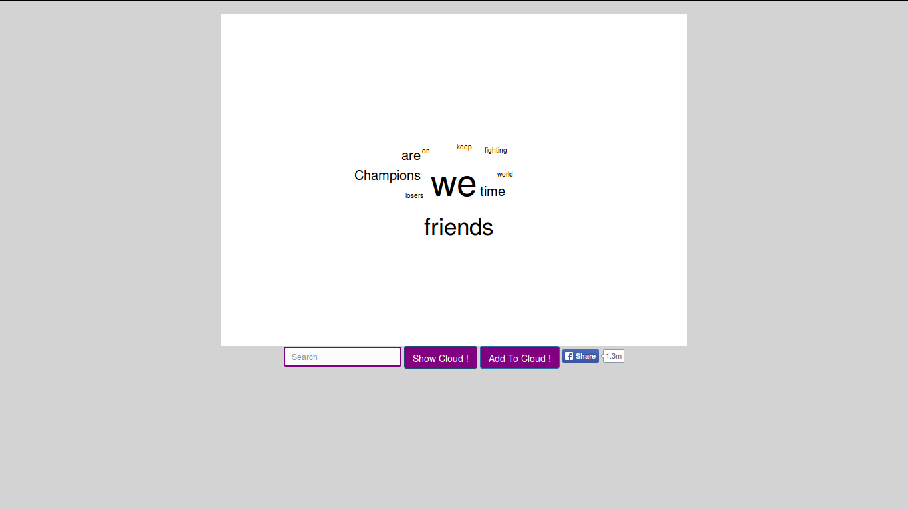
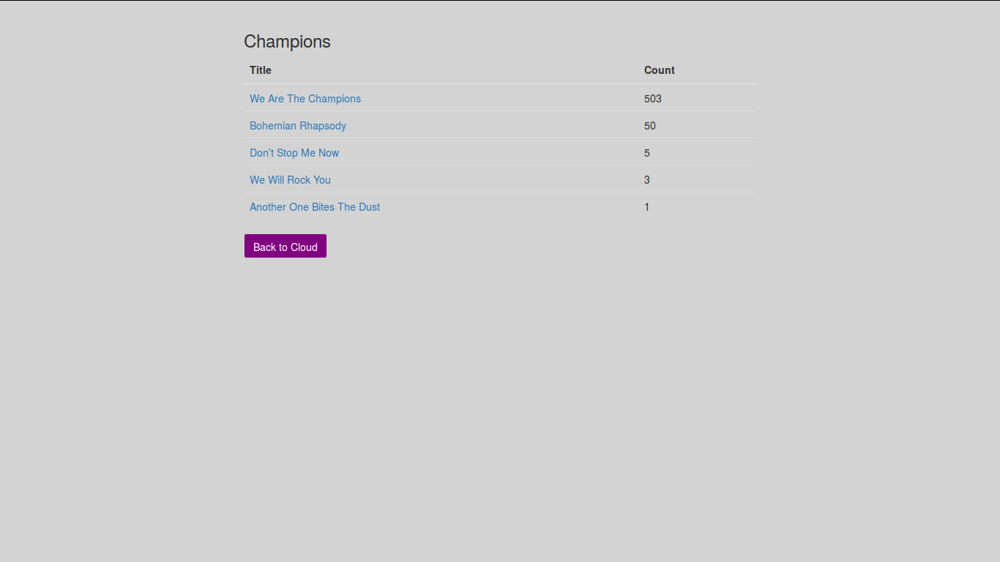
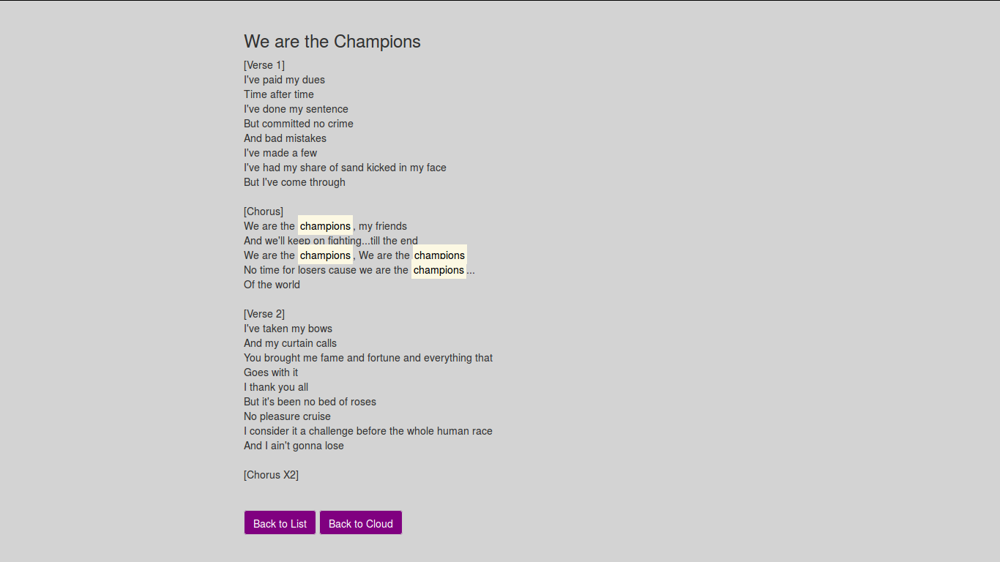

\title{C-lyrics - A Word Cloud for Lyrics}
# Executive Summary
C-lyrics is a public website that will generate a word cloud for any given artist based on the most frequently used words that appear across all of the artist’s published songs. This product will interface with the EchoNest API which will serve as the database from which we find and analyze the songs. By clicking on a specific word in the word cloud the user can see a list of all of the songs that word appears in and how frequently it occurs in each song. Furthermore, the user can click on any listed song title to see the complete lyrics for that song with the original word that was selected from the word cloud highlighted every time it appears.

C-lyrics is intended for use by the general public. There will be no login required and there is no stored history of previous searches. Because of this we will have very low memory requirements and can run the product off of one server. The user can access C-lyrics using any device running any OS, assuming it has an internet connection. After typing in the artist name and selecting the submit button, the word cloud will be generated and will be able to be shared via Facebook.

\pagebreak

# 1. Introduction
## 1.1 Purpose
The purpose of this document is to clearly describe every aspect of the first group project for the CSCI-310 course taken at the University of Southern California in the Spring semester of the year 2015. The intended audiences of this software requirements specification document includes, but is not limited to: the members of group six whose names are listed on the front page of this document and by whom this document is prepared, the professor of the course Dr. William G. Halfond, and the teaching assistant Sonal Mahajan. Other possible audiences include: students who are at the time of this publication taking the course in which this project is assigned or any future students of this course who may read this document should it become available to them by the course instructor Dr. William G. Halfond or by any other means which cannot be predicted at this time. This software development project will hereafter be referred to as C-lyrics. It is intended for any user with an internet connection-either through a mobile or stationary platform-who wishes to create a word cloud based on the lyrics of songs from various artists.

## 1.2 Scope
C-lyrics is a web based application for generating a multiple colored, horizontally positioned text, word cloud generated from song lyrics of an artist specified by the user. The user will simply search for a desired artist and if the artist’s lyrics are supported by C-lyrics, a word cloud of the most common words that appear in the artist’s various songs will display for the user.

C-lyrics will be hosted and available to the World Wide Web and will require no user registration or membership. To access the C-lyrics service, a user only needs an internet connection and one of the commonly used web browsers. C-lyrics will use the EchoNest API to generate the lyrics of selected artists and will then log a list of songs where the lyrics are derived from, including a word cloud of the most common words from the those lyrics.

## 1.3 Definitions, Acronyms, and Abbreviations
**
T
O
D
O

* wordcloud_numWords (2.1.1 - Number of words displayed in wordcloud)
* searchbar_minChars (2.1.2 - Number of characters entered to start autocomplete)
* searchbar_numArtists (2.1.2 - Number of artists displayed by autocomplete)
* wordcloud_timeToGenerate (2.1.2, 3.1.1 - Time required to generate wordcloud seconds)
* searchbar_timeToAuto (3.1.1 - Time required to display autocomplete results ms)
* lyrics_timeToBack (3.1.1 - Time to return to home page or songs page in ms)
* performanceDelay (3.3 - Time to perform all functions on homepage, songs page, and lyrics page)
* Add to Cloud Button - Button on wordcloud interface that allows users to add another artist’s lyrics to the previously created wordcloud

## 1.4 References
[1] IEEE. IEEE Std 830-1998 IEEE Recommended Practice for Software Requirements Specifications. IEEE Computer Society, 1998.

[2] “word cloud”. [Oxforddictionaries.com](http://www.oxforddictionaries.com/us/definition/american_english/word-cloud) (January 31, 2015)

[3] EchoNest API [documentation.](http://developer.echonest.com/docs/v4/index.html#overview) (January 29, 2015)

## 1.5 Overview
Further sections of this document include detailed descriptions on various modules of the C-lyrics software and methods used to develop this SRS. In section 2, C-lyrics’ various interfaces are described. In section 3, a detailed account of the customer’s specifications is explained. To view the source of these customer requirements, refer to appendix A.1 near the end of the SRS which contains meeting notes between the development team and the customer. Finally, section 4 details the change management process by which changes to this SRS are submitted. The document concludes with the appendices which will provide an account of the information exchanged between the customer and the development team as mentioned before, and with some prototype design images.

# 2. Overall Description
## 2.1 Product Perspective
This product will be dependent upon data from the API. The C-lyrics system will be responsible for grabbing information given by the user via search box, and sending the artist name to the API which will provide song lyrics for us to analyze and synthesize. From there, the C-lyrics system will filter the appropriate words to be displayed in the image of a word cloud. Provided the user has internet connection, C-lyrics will function on any mobile or stationary device.

### 2.1.1 System Interfaces
There will be three main system interfaces for C-lyrics:

*   The Home Page will include a search box and submit button adjacent to one another, and will appear underneath the space dedicated to generate the WC.

    * To generate the WC, lyrics will be pulled from a database provided by the API and filtered to display the wordcloud_numWords most frequently used words by any given artist.
    * After a WC is generated, the Add to Cloud button and share button appear next to the submit button. The new word cloud will be generated in the same dedicated space.

*   The Songs Page will be displayed after a user selects a word from the WC. This word will be displayed at the top of the screen, and a list of all of the artist’s songs in which the word occurs will be displayed below it. This list will be organized by the frequency of the word’s use in each song. A button will be displayed at the bottom where the user can go back to the first interface.

*   The Lyrics Page contains all the lyrics of a specific song which the user selects from the generated list on the second interface. Two navigation buttons will be located at the end of the lyrics page, one where a user can go back to the first interface where their original search started and another that will go back to the second interface with the list of songs.

### 2.1.2 User Interfaces

*   Logical characteristics of each interface:
    *   Interface I (Home Page): Will contain a bg_color background and 4 key elements. It will have a bg_color search box outlined in main_color  and two adjacent buttons on it’s right side, one being a search button and the other being a share button for the WC. The search box will be located at the bottom of the page and the bg_color search cloud will be generated above that will contain no more than wordcloud_numWords words. There should be enough space between the bottom of the page and the search box to contain a drop down for the autocomplete feature.
    *   Interface II (Songs Page): Will also contain a bg_color background and 3 main aspects. The selected word from the WC will be the title of the page, and underneath the title will be a list of all songs that contain the selected word. There will be a button at the bottom of the page that allows the user to go back to the first interface.
    *   Interface III (Lyrics Page): Will contain a bg_color background, and will have the title of the selected song above the lyrics for that song. The word that was selected from the WC will be highlighted in highlight_color throughout the lyrics. Two buttons at the bottom of the page will allow the user to go to either Interface I or Interface II.

*   All aspects of optimizing the interface with the person who must use the system:
    *   Interface I:
        *   As the user is typing an artist’s name in the search bar a drop down list of suggested artists whose name contains the typed string will appear
            *   This auto-complete function will span the width of the search bar
            *   The complete list of artists’ names that begin with the characters typed in to the search bar will appear before any artist’s name that contains the typed string but does not start with it. However, both artists whose name starts with the typed string and artists whose name contains the typed string will appear in the drop down list
            *   There will be searchbar_numArtists artists’ names visible initially with a scroll down bar to see the rest of the artists
            *   There will be a picture of each artist to the right of their name
        *   The user will be able to create a generated WC in under wordcloud_timeToGenerate seconds by pressing the submit button after typing in a specified artist
            *   If there are no lyrics available, or an artist was entered incorrectly, the space used for the word cloud will generate an error message to display to the user that the system was unable to identify lyrics given the artist specified
        *   The user will be able to share the generated word cloud via Facebook
        *   The user will be able to click on a specific word to see all of the songs that word appears in from the specified artist. The song titles will be sorted by how frequently the selected word shows up in each song. (see Interface II)
        *   The user will be able to create a new WC by adding a second artist that the wordcloud_numWords most frequently used words by both artists will be displayed
    *   Interface II:
        *   The user will be able to click on any song title displayed to see the complete lyrics of that song with the selected word highlighted in highlight_color every time it appears (see Interface III)
        *   The user will be able to click on the back to home button to take them back to the generated word cloud with the artist name still displayed in the search box
    *   Interface III:
        *   Displayed will be all the lyrics from the specified song in Interface II, and the title of the song will be the header of the page
        *   The searched word will be highlighted in highlight_color whenever it appears throughout the lyrics
        *   The user will be able to click on the back to home button to take them back to the generated word cloud with the artist name still displayed in the search box
        *   The user will be able to click on the back to songs button to take them back to the list of songs that the specified word appears in

### 2.1.3 Hardware Interfaces
C-lyrics is an online, browser based application that will be supported by any device that has internet access and any browser that supports HTML5.

Access devices include but are not limited to any OS running on:

* Mobile phones
* Tablets
* Laptop and desktop machines
* Other internet enabled devices with browser support such as televisions

In addition, we will host the product on a virtual machine run server.

### 2.1.4 Software Interfaces
All required software interfaces will be handled by the API on the back end of the product. The user does not need to worry about interfacing with any outside software. We have chosen to use the EchoNest API because it has a vast capability for searching for artists and songs.

EchoNest API

* We are using the EchoNest API as the database for retrieving all of the artists and songs. This API will provide the information for us to sift through and format into the WC.
* EchoNest API documentation can be found in section 1.4

### 2.1.5 Communication Interfaces
The chain of communication for C-lyrics will be the user input to the back-end system of C-lyrics, back end server communicating with the API, then communication back to the interface to display the information in the form of a WC back to the user.

### 2.1.6 Memory constraints
C-lyrics will have no memory of previous searches or user data. All artist information and lyrics will pulled from the database of our chosen API. Therefore the memory capability is not limited by C-lyrics, but by the capacity of the API. We will be able to host our product using one server.

## 2.2 Product Functions
The intended purpose of C-lyrics is to produce a word cloud based on all lyrics from a specified artist. The user will input an artist’s name, thus generating a WC that contains frequently used words from all of their published songs. Several functions C-lyrics are as follows:

* Should have an auto-complete drop down when searching for artist as well as a complementary image per artist
* Allowing the user to select any word from the WC and generate a list of songs that contains the selected word along with the frequency of that word per song
* Displaying the lyrics of a specific song when selected from the generated list described in the bullet above

## 2.3 User Characteristics
C-lyrics is intended to be used by anybody with any education level and with no required technical background. It will be most helpful to music enthusiasts, but is not limited to their use. There is no necessary log in as C-lyrics is available to everyone. While there is no age requirement, explicit language in songs is not censored so children should be supervised when searching for artists.

## 2.4 General Constraints
The current constraints on the project are due to the feasibility of certain features. These include achieving complete accuracy on facial recognition for the auto-complete image, limited and or incorrect data for artists’ known songs and lyrics, and capability of capturing the unified image of the word cloud to share on Facebook. Also, internet access is required, and C-lyrics is dependent on the availability of the API.

For testing purposes, a simulating tool maybe be used to test out possible cases to ensure the outputs will be as desired, such as unit testing for front and back end, as well as end-to-end testing.

## 2.5 Assumptions and Dependencies
A number of factors that may affect the completion of requirements in the SRS include:

* The limited amount of data provided by the API not accounting for all lyrics
* Image recognition based on bands may not produce 100% accuracy when identifying artists or bands
* Capturing the individual words of the WC as a unified image
* Performance time may exceed the desired amount of time to produce the WC,
 wordcloud_timeToGenerate
* The performance of the API will be assumed as correctly functioning, therefore basing the WC on the primary function of the API

## 2.6 Apportioning of requirements
Requirements that may be delayed until future versions of the system have been completed will include:

* Pricing agreements for how much the system will cost per user and such a pricing policy will be administered and specified in a later version
* Capability to download the image onto a device and save it in the appropriate format

# 3. Specific Requirements
## 3.1 External Interface Requirements
### 3.1.1 User Interface

#### Page Color Scheme
For all three web pages (home page, songs page, and lyrics page) the background should be light page_color. The default text_color font of the browser should be used throughout the application. On the lyrics page, the highlighted text should be highlight_color. Other visual elements specifications will be defined in the following subsections. The color requirement is essential.

#### Search Bar and Submit Button
The search bar will receive the name of an artist as a query. This text shall be given as input by any means accessible to the user, but must exclusively contain alphanumeric characters. The search bar, including the submit button, will have the same width as the WC, on a desktop platform. On a mobile platform, the search bar will be under the WC and above the  submit button, all three of them having the same width. This text will be transmitted to the backend. The whole communication will be done through AJAX, and when the response arrives it will be handled by the autocomplete. The command to generate the WC is a mouse click on the submit button or the browser's command to submit a form (usually the "enter" key). This will generate a word cloud given an artist name. In 100% of the cases, the time between the mouse click and the display of the WC should never exceed wordcloud_timeToGenerate seconds.

The search bar will have a text_color text with a bg_color background. The borders will be  main_color. The corners of the input box might be slightly rounder (about 5px) and a placeholder is optional. The submit button should be main_color and its text should be bg_color.

The purpose of the search bar is to allow the user to select and search for a specific artist. Once the search has been performed and one artist has been selected, the WC shall be generated. The search bar feature is an essential requirement.

#### Autocomplete
The autocomplete acts as a response to the user's input in the search bar. Its input comes from a response of the server and will be in the JSON format. The autocomplete does not output a value, however it will modify the graphical interface of the application by appending a drop down to the search bar as described in Section 2. Once an artist has been selected through a mouse click on a list entry, the autocomplete will disappear from the graphical interface and the name of the artist will appear in the search bar. In 100% of the cases, this display of the dropdown will happen in less than searchbar_timeToAuto seconds after the response from the server has been received.

The borders of the autocomplete will be main_color, and the text and images inside the dropdown will be text_color over a bg_color background. The height of the images inside the dropdown will depend on the total window size, in order to avoid scrolling the main browser’s window to reach the bottom of the drop down. At any point in time, whether during the creation of the WC or creation of the autocomplete, the position of the search bar should never change relatively to the top of border of the browser window.

The purpose of the autocomplete is to help the user select a single entry from a list of artists whose names match the query in the search bar. The autocomplete feature is a conditional requirement.

#### Word Cloud
The word cloud takes as input a list of words and creates bg_color graphic with multicolor words and displays it in the horizontal center of the home page (see Appendix for example). The graphic contains the words from the word list written in multiple colors over a bg_color background. The size of the graphic will span 75% of the window on a desktop platform and the entire screen width on a mobile one. The words appearing in the graphic are the set of all words in lyrics of all songs by the selected artist or artists, and are received from the backend. Note that these words should not include the most common english stop-words. These words have a different size depending on the frequency at which they appear in the songs. A conditional requirement is to have a waiting spinner during the time the WC is being generated. In the case where the searched artist does not exist, there should be a text_color error message over a bg_color background, in place of the WC.

After the WC is generated, an Add to Cloud button and a share button will appear next to the submit button. If the user types another artist name into the search bar and clicks on the Add to Cloud button, a new WC will be generated that compiles the most common words used by both the first and second artists. The Add to Cloud button and associated features are conditional requirements.

By clicking on the share button, the user will have the ability to share the displayed WC on Facebook. This button will have the standard Facebook color scheme. The share button and associated features are conditional requirements.

The purpose of the WC is to display the frequency of words in an artist's discography and offer a visually pleasant interface to access a list of songs containing a selected word. The WC is an essential requirement.

#### List of Songs
The list of songs on the songs page offers very little interaction. It is generated as list of the songs' titles. For each title, the list displays the title with a link on it and the number of occurrences of the the word in this song. The link is main_color and the text of the counting is of text_color of a bg_color background. The list is centered in the page. At the bottom of the page there is the back to home button which has the same color scheme as the submit button. It is not possible to reach the songs page without having specified which artist and which word the user wants to inspect.

The purpose of the list of songs is to allow the user to select a song of which he wants to see the lyrics. He also has the possibility to go back to the homepage through the back to home button. The list of songs is an essential requirement.

####Lyrics
The lyrics page offers even less interaction than the songs page. The only possible input is a click on one of the two buttons: the back to home button and the back to songs button. The only possible input for both of these navigation buttons is a mouseclick. Once the click is done, the timing for the action to occur should take less than lyrics_timeToBack milliseconds in 100% of the cases. Both of the buttons' behaviour is specified in Section 3.2. It is not possible to reach this page without having first specified an artist, a word, and a song whose lyrics will be displayed. The lyrics of a given song are displayed at the top center of the page, aligned to the left hand-side of the screen. All occurrences of the word that was clicked in the WC are highlighted in highlight_color. The lyrics page is an essential requirement.

### 3.1.2 Hardware Interface
#### Server
The system shall be one or several machines serving the page to the user's browser and be able to make HTTP requests on the API. In order to achieve those tasks, the machine should have a modern internet connection (>= 10Mb/s in upload) as well as the TCP/IP port 80 open and accessible from anywhere on the internet.

### 3.1.3 Software Interfaces
#### Apache Server
The Apache [HTTP Server project](http://httpd.apache.org/) will be responsible for serving the static content to the user's browser as well as requesting data from the API. As such it will require access to the port 80 of the machine. In addition, the backend should have access to persistent memory of the system.

#### JavaScript
The browser should have full support of ECMAScript 5 and be able to make asynchronous JavaScript and XML requests through the HTTP protocol. It should also be able to correctly display HTML5 and CSS3 elements.

## 3.2 Functional Requirements
This section specifies principal actions and functions of the software.

### 3.2.1 Homepage
#### Artist Search and Selection
The user shall be able to search artists for which he wants to create a WC. In order to access this functionality he should start typing in the search bar and a list of suggested artists will appear. This list will be sorted by artists whose name starts with the typed string first followed by artists whose name contains the typed string, but does not start with it. There will be a picture of each artist displayed to the right of their name. The user will then be able to select an artist from the dropdown. This feature is an essential requirement.

#### Creation and Display of the Word Cloud
By clicking on the submit button, the user will see a waiting spinner before the WC is generated. Once the the backend answered the request of the frontend, the WC will be generated within the next wordcloud_timeToGenerate ms. The world cloud will provide links to the songs list page as and will implement the color scheme specified in Section 3.1.1. Creating the word cloud is an essential requirement.

#### Transition to the Songs List
Through a single mouse click on one of the words in the WC, the user should be redirected to the songs page. For this function to work, every word in the WC must be linked to the same web page (songs list) but passes different parameters to the page, which will adapt itself to those given parameters. Several abnormal cases are possible:

*   The internet connection is dropped: Minor problem, as the content of each song and each word will be stored in the browser’s memory. However in such a case, the system should make sure that the template for the songs page is cached in the memory as well.
*   The user clicks on a second image before the songs page has been loaded: Note that this case is very extreme, as the transition from a page to another should take less than wordcloud_timeToGenerate ms. However if this happens, then the user shall be redirected to the songs page  for the second he clicked, and not the first one. This problem could arise through the asynchronous nature of JavaScript.

Instead of ensuring that the redirection link is valid which is a tedious task, the system should ensure that a non-valid link is never generated. Transitioning to the songs list from the homepage is an essential requirement.

#### Sharing of the Word Cloud
The software shall offer the possibility of sharing the currently generated WC on Facebook.com through the click of a button. In order to access this functionality, the user should have first created a WC by selecting an artist and clicked on the submit button. Then, Facebook’s embeddable share button will appear on the right of the submit button and the user will be able to perform a mouse click. By doing so, the user will be presented with Facebook’s visual display to share the WC on their web page. Note that as the supplier is not the provider of this functionality, they can not ensure any kind of consistency in the user experience of the share button, nor in its availability. The sharing feature is a conditional requirement.

### 3.2.2 Songs Page
#### Count of Words per Song
This functionality shall determine the number of occurrences of a given word in a song. It is essential as it will determine the number that will be appended next to a song’s title in the songs list. In order to activate this functionality the user will only have to browse the songs page and the computations will be done automatically. Again, this should only be possible if the software is given a word to look for and an artist’s discography. In the special case where either one or both of these conditions are not met, the user should be redirected to the homepage. The number of occurrences is not expected to go over the maximal value int value of JavaScript however if it does, then an error message should notify the user. This error message will have the same behaviour as a standard browser popup. The count is a conditional requirement.

#### Transition to the Lyrics Page
By clicking on a song’s title, the user should be redirected to the lyrics page which will display the lyrics of the selected song. This link shall not provide any wrong parameters to the lyrics page and it will only be activated through a mouse click event. The transition will be similar to the browser’s transition of a web page to another. An abnormal behaviour would be an interrupted internet connection, in which case the software will have cached the requested web page, as well as the necessary data (ie, the song’s lyrics and information) in the browser’s memory. Another special case would be if the user clicks on two links at the same time, or if the second link is clicked before the lyrics page has been loaded. In such a case, whichever link was clicked last shall be loaded by the software and displayed to the user. Transitioning to the lyrics page from the songs list is an essential requirement.

#### Transition to the Homepage
The back to home button shall offer the possibility of being redirected to the homepage through a mouse click. If this action is executed, then the homepage will be displayed exactly as the user left it when navigating to the lyrics page. As the link to the homepage will always be the same, the function will need to check that the stored data history fulfills the requirements to re-render the exact same homepage. If this is not the case, then the software shall not try to render a partial view of the page but will simply display the original, blank homepage. If the internet connection is suddenly dropped, then the software shall furnish a cached version of the template and the data that was requested. In the special case where two redirecting events overlap, the software will then redirect the user to the one finishing last. Transitioning to the homepage from the songs list is an essential requirement.

### 3.2.3 Lyrics page

#### Highlighting of the Matching Words
Once the user navigates to the lyrics page after selecting a song from the songs page, the word that was originally clicked in the WC will be highlighted in the lyrics page. The highlighter color will be highlight_color. The highlighted words will be neither clickable nor changeable unless the user goes back to the homepage and selects a different word entirely. This feature is a conditional requirement.

#### Transition to the Songs List
The user shall be able to transition back to the songs page by single clicking the navigation button. The songs list on the songs page will be generated according to the same word from the WC. The transition will be the same navigating to a new page, but with the same data before arriving to the lyrics page. There will be no parameters when navigating back to the songs page because the old parameters will not be changed. Transitioning to the songs list from the lyrics page is an essential requirement.

#### Transition to the Homepage
Similar to the Transition to Homepage from 3.2.1. The user will navigate back to the homepage via the navigation buttons. The homepage will look exactly the same based on the original artist the user selected prior to arriving to the lyrics page. Transitioning to the homepage from the lyrics page is an essential requirement.

## 3.3 Performance Requirements
All functions in the homepage, songs page, and lyrics page shall be performed in under performanceDelay seconds, assuming that the user runs the software on a standard machine with a stable connection. The software will be available for a private user but can be opened to the public given proper web hosting. Once it is hosted, the software can accommodate multiple users at the same time. There will be no user data stored longer than a single session. All calls will be made to the API for data retrieval.

## 3.4 Design Constraints
The software may be constrained by the hardware available for the user. The software will require an internet connection as well as a machine that is capable of loading web pages in a reasonable time constraint. Without an internet connection, the software will be unable to run. A machine incapable of loading web pages will not be able to run the software. The backend must be developed on top of the PHP language.

# 4. Change Management Process
This document is anticipated to change over time as requirements, scope, and specifications change. To accommodate for changes, all members of the development team will decide on the changes to be made. Afterwards, a selected member will access the master document which will be accessible to all members through the group’s google doc to input the changes. All members will then review the material and edit said change(s) if need be. Finally, after the editing process the document with the new additions and change or changes will be submitted, meaning that it will be officially part of the SRS.

# 5. Appendices
We list here the steps we took during the requirements process. In particular we describe the different interactions we had with the client.

## 5.1: Appendix 1: Feasibility Study

### Technical Feasibility
Given the current web technologies that exist today, we believe that the project is technically feasible. We have access to all the technologies that need to be used. Fortunately, we also have enough technical knowledge to develop the requested product but no experts in any of the technologies required in the development team. The client specified that they require the use of PHP in the development of the product, this requirement is also feasible. We also have access to technologies that will help us build this project such as several IDE platforms.

### Economic Feasibility
Due to the number of members in the development team and the team’s current experience level, and budget, the proposed project is feasible. Furthermore, hardware, and third party service provider costs such as internet hosting are manageable. The two alternatives to meet third party service provider costs for hosting at the moment are:
*a) Amazon Web Services (AWS) and,
*b) University of Southern California web hosting services.
The latter of the two alternatives is the most cost efficient as it as a free service provided to students at the University of Southern California which applies to all members of the development team.

There are certain difficulties which are hard to estimate at the this stage of planning.  The most important difficulty to consider is the requirement to have WC results display within wordcloud_timeToGenerate seconds of the search query. This issue is of both an economic and technical nature. At this point, variables such as user internet speed, hosting server processing speed, flow of information from third party APIs, and the WC generating algorithm all complicate our estimation of how feasible it is to implement this required feature. Any change in the before mentioned variables can cause a fluctuation in completion time of C-lyrics which will in turn affect the budget. Therefore, this a requirement that needs to be negotiated with the client. Please refer to Appendix 5.3 to review negotiations with the client.

### Schedule Feasibility
At this time, we can only identify required deadlines. As mentioned before, due to the C-lyrics nature as a class project, missing these key deadlines is disastrous for the development team. These deadlines are non negotiable and set by the class schedule, which is, as mentioned in the introduction section for this document, CSCI-310 at the University of Southern California for the Spring 2015 term. The project schedule is therefore bound to the class schedule. Note the class schedule for the deliverables have the possibility to change. The class deadlines at the time of this publication are as follows:
*Project Management Plan due February 9, 2015
*Design Document due February 18, 2015
*Implementation (Completion of C-lyrics software) March 4, 2015
*Testing and delivery of completed product due March 11, 2015

At this point, the development team estimates that it will take about 3 days to be trained in technology that needs to be used in order to complete this product. The technology includes, Java Script, PHP, CSS, HTML

## 5.2: Appendix 2: Notes From Meetings With Customer (Elicitation)
### 5.2.1: First Meeting on January 26, 2015
#### Natural Language Specifications

*   Standard Scenario User Interface
*   Go to the home page
*   Type artist name in search box
*   Click “submit” button next to search box
*   When clicking on the search from the drop down, it will populate the search bar w/ that artist
*   Display to be updated w/ word cloud of user selected artist lyrics
*   Descriptive error message in the word cloud ("couldn't find the artist"), if artist not found in search
*   Would like input search box to stay there after cloud is generated
*   When a word on the cloud is clicked, go to second page
*   Second page has the song listings for the specified artist. when a word is clicked on the cloud, display a list of all the songs that have that word in the lyrics and the frequency of the word
*   Button will be on second page, after the words have been listed
*   When link of a song is clicked, want to see all the lyrics and that word to be highlighted
*   Button to go from page 3 to 2 and page 3 to 1
*   When going back to page 1 from any page, it should populate the original search of the user

#### Graphical User Interface

*   Page background color: solid grey background for the main page
*   Input box: outlined in purple w/ white background inside the box and text_color text when typing search item
*   ”Submit” button should be purple, will initialize search for inputed text in search bar
*   Specific colors for word cloud: text_color text on a bg_color background
*   Word cloud display box shape should be rectangular
*   Highlighting should be purple
*   Use default font for the browser screen
*   Shape of text should be “something cool”
*   Word cloud text should be text_color and bg_color

#### Constraints and Restrictions

*   Product could have limited amount of artists. Finite number
*   No restrictions on songs
*   Must use PHP
*   No java, no ruby, no .NET
*   No restrictions on server hosting
*   Search results and display to be returned in 1 second
*   Do not keep history

#### Word Cloud Functionality

*   Size of the word should be proportional to it's frequency
*   Stop word filter on articles, pronouns

#### Optional Features

*   Loading spin graphic when generating word cloud
*   Share lyrics on facebook

### 5.2.2: Second Meeting on January 28, 2015
*   Q1. Are there more than three pages?
*   A1: No
*   Q2. Where should the "share link" be?
*   A2: Button shows up next to the submit button to share with the same theme as the search button
*   Q3. How many songs should be on per page?
*   A3: ALL the songs from artist
*   Q4. Do you want pagination of the list of songs?
*   A4: no need for  pagination, all results on one page
*   Q5. Is the word cloud supposed to just be a rectangle? Is there even a cloud?
*   A5: It is a rectangle
*   Q6. What about spacing in the rectangle?
*   A6: The whole background is white, so spaces are all white
*   Q7. Is the search box supposed to be at the bottom?
*   A7: Yes
*   Q8. How large should the word cloud be?
*   A8: “must be visually pleasant”
*   Q9. On second page, should it be in order of title (A-Z) or should it be in *   greatest to least of number count?
*   A9:ordered by word count, in decreasing order
*   Q10. How many letters does the auto-complete need to start after?
*   A10: “whatever is reasonable”
*   Q11. What color should the auto-complete box be? What about the color of the *  words?
*   A11: White background, black text, purple border
*   Q12. Does the rectangle resize based on how many words are in it?
*   A12: No
*   Q14. Lyrics on the third page, adjustment? Left, center, right?
*   A14: Left aligned
*   Q15. What happens when you click on the lyrics?
*   A15: Nothing
*   Q16. What visually on the first page? Just the search box and the go button?
*   A16: From top to bottom: empty area above for word cloud, a search box with a submit button to its right and a share button to the right of the submit button when cloud is generated
*   Q17. What is being shared? The word cloud? The list of pages for the songs *    that have a specific word? The actual song and its lyrics?
*   A17: word cloud
*   Q18. Is the speed of how fast it took to search supposed to be shown?
*   A18: Doesn’t matter
*   Q19. Want a count of how many words are in the cloud (google example)? What color if so? What font? What size?
*   A19: No word count
*   Q21. How important is the download? What’s the priority?
*   A21: it is optional

### 5.2.3: Third Conversation With Client on 2/1/2015
*   Q1. When you erase the artist’s name from the search box does the cloud disappear or does it only disappear when you try to generate a new cloud?
*   A1: Only when a new cloud is generated
*   Q2. Are the words supposed to be arranged in the cloud in a random way or are they alphabetical, sorted by frequency, etc? If placement of each word is random, when you generate a cloud for a given artist multiple times should the generated cloud be the same or different every time?
*   A2: No particular preference for arranging the words in the cloud
*   Q3. Is the drop down list of suggested artists anyone whose name contains that string or anyone whose name starts with that string?
*   A3: Either way is fine
*   Q4.  How should the layout change for mobile uses? Do you want the "Generate Cloud" button to be under the search bar to save space? Should the word cloud take up the whole screen?
*   A4: My only expectation is that the website in general should look good and be readable on a mobile device. What you have suggested are good ideas.
*   Q5. What is the purpose in ordering this product?
*   A5: The sole purpose is to allow my end users to create a word cloud of the songs' lyrics of a given artist.
*   Q6. How do you plan to use this product and who is your target customer? Is this product only for you or should it be public for the general population to use?
*   A5: This product is meant for the general population. The end users will access the product using a website.
*   Q7. Is there any specific functionality you don't want this product to have?
*   A7: No
*   Q8. Who do you consider as competitors who have a similar product?
*   A8: None that I am aware of
*   Q9. How should we deal with poor internet connection in regards to the 1 second search requirement? And more generally, what should we expect from the user(s) of the application in regards to the hardware they are going to use ? (eg, should we support very old machines, very low performance devices, etc...)
*   A9: For the 1 sec requirement, I see your point. However, the response time should be reasonable, say 5 sec, and the end users should not have to wait for a very long time to see the results. If the internet connection is very poor, then maybe you can display some informative message to the user. With respect to the hardware requirement, it is difficult to say the kind of platforms the end users will be using, since the website is meant to be used by the general public.

###5.2.4: Complete Specifications Notes
#### Website Layout
*   solid gray background
*   all words text_color text on a white background – default font on top
*   textbox and wordcloud on top of the button
*   input box to be outlined as purple with inside white and text_color text, button is purple themed with readable words
*   blank screen and then the word cloud shows up when pressed make cloud
*   can you exit out of the word cloud like a pop up
*   no log in or history
*   back button same theme as submit and share button and when you go back the word cloud is still there, the search result doesn’t go away until you type in a new artist
*   descriptive error messages

#### Shape of Cloud
*   use tagcloud or wordle
*   adaptable sized rectangle based on number of words in the cloud (no more than 250 words – make it look nice)
*   all horizontal words
*   no overlap of words
*   the prototype with white background only on the word is ok

#### Search Results
*   top 5 most relevant results with a scroll bar that shows all of the results
*   yellow highlight in the song on the third page
*   autocomplete to start after a reasonable amount of letters
*   second page songs sorted by frequency
*   lyrics are left aligned
*   list all songs on the second page and scroll all the way down
*   use reputable lyric sites – doesn’t have to be perfect
*   support “all years” of music 50’s or 60’s
*   don’t show search length or number of results
*   the word cloud should be able to be shared on FB (no where else) but doesn’t need to be downloaded
*   button shows up next to the submit button to share with the same theme as the search button
*   from lyrics page can only go back to the word cloud or the songs page
*   pictures in the drop down of the artists, don’t care if they are circles or squares
*   something that is useful be it their face or something else useful
*   EchoNest has a lyric find functionality

#### Website Structure
*   control logic on server side based on PHP but you can have some Javascript/ CSS/ HTML
*   build a local server on a virtual machine and host it there
*   USC offers free hosting

#### Hardware requirement on SRS
*   only a computer, pretend that we will put it up on a server

#### Software Interfaces on SRS
*   where the APIs are coming from etc

#### Communication Interfaces on SRS
*   not as applicable, could just leave it out entirely

#### Functional Requirements on SRS
*   one user type so only User Type One – what the user can do not how they can do it

#### Performance Requirements on SRS
*   less than one second desired, could be longer though

## 5.3: Appendix: Negotiations
### 5.3.1 Choice of the Programming Language
In the very first meeting, the client expressed its will to use PHP. His brother advised him to do so, and he required us to use this programming language. We argued that the application could be faster by completely omitting a backend, thus getting rid of PHP and only using JavaScript with asynchronous requests. However the client insisted to use PHP.

### 5.3.2 Images in the Autocomplete
Another issue appeared in the first meeting when the client asked us to have matching images to the artists’ names in the autocomplete. The requirement was that it had to be the correct matching image for all artists since the 1960’s. This seemed unfeasible to us and we tried to argue for occasional errors in the images. The final conclusion was that by using an external API, we could delegate this work and assume that the furnished images will match the artists’ names.

### 5.3.3 Word Cloud Shape
Initially, the client asked us to generate a perfectly rectangular cloud. When we suggested for the cloud to have an cloud-like shape and as this is easier for us to build by using pre-existing libraries, the client accepted our suggestion.

### 5.3.4 Number of Simultaneous Users
When asked the number of simultaneous users this software should support, the client initially asked how many we could support. As the application is easily replicable across multiple machines, we could support as many users as the client required. The suggested number of one billion simultaneous users however dropped to ten after mentioning the maintenance cost of such a large scale architecture.

###Meeting with client on February 5, 2015
*The client originally desired the WC to be displayed within a rectangular shaped area above the search bar’s position. After consulting with the client about the importance of this particular quality, we ascertained that it was not a quality that she cared for too much. We informed her that sizing limitations on the WC could complicated the project. Client agreed, and specified that  the WC can be any shape as long as it is on a white background.

*The client originally desired the WC to be generated within 1 second from the time the Submit button is clicked, signaling a lyric search. According to our feasibility study (@TODO)  this task would require too much extra effort and implementation would be challenged by several factors which would hinder its success. Consequently, the client agreed to change this restriction to 10 seconds. The WC should be generated within 10 seconds from the time the Submit button is clicked.

## 5.4: Appendix 4: Specification
All along this first phase of the project, the development team kept refining the requirements of the project, according to the wishes of the client. As underlined by our meeting notes (See appendix 5.2) the suppliers and client met twice a week for the past two weeks. Those meetings led to several changes in the original requirements, and hopefully the agreed requirements all appear in this document.

## 5.5: Appendix 5: Validation
While trying to understand the exact specifications of the required software, we came back to the client with several suggestions. In order to simplify the communication of these requirements, we built a fully interactive (but non-functional) prototype. After having this prototype validated by both clients on 1/28/15, we wrote this document, formally specifying each requirement.

We submitted a second version of this document (the SRS) to the client for approval on 2/8/15 at 5:09pm Pacific Standard Time. We received no feedback on this submission.

## 5.6: Appendix: Screenshots of Prototype

